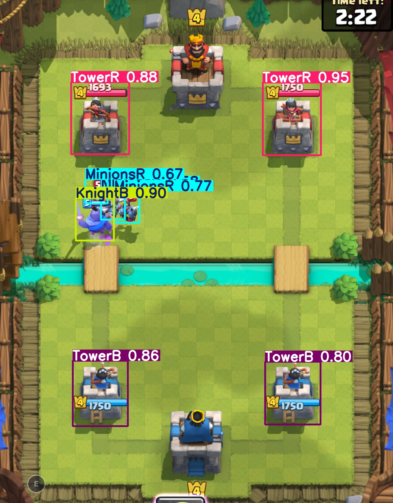

# ClashRoyaleAgent
This project started Sum 2025 and is designed to create a smart agent that can real time play a clash royale match. The agent uses a CNN and various other image recognition tools in order to understand the game state. From there we are implementing reinforcment learning in order for the agent to learn how to play the game.

This readme will be flushed out more as the project gets closer to being finished. Currently a working real time cnn has been implemented than can detect various cards on the screen. Currently RL is being implemented. 

Results of CNN Inference post training:

